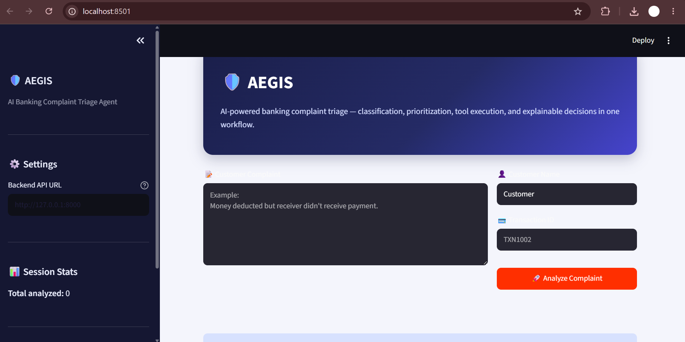
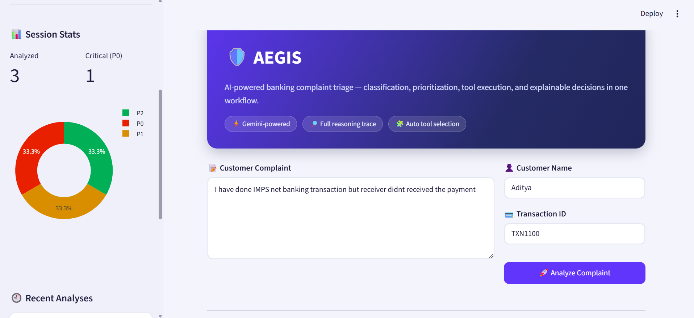
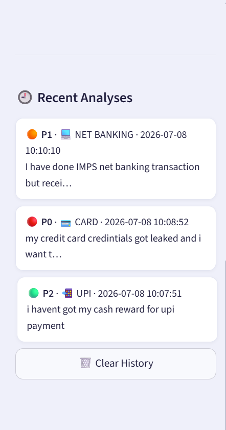
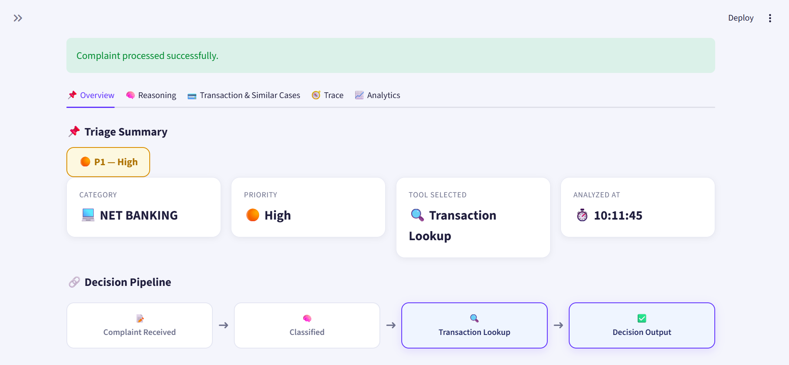
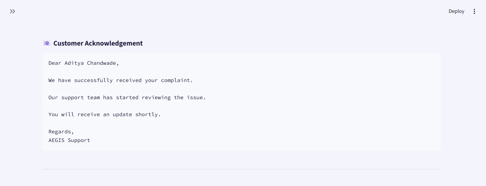

# 🛡️ AEGIS — AI Banking Complaint Triage Agent

**AEGIS** is an AI-powered banking complaint triage system that classifies customer complaints, assigns priorities, and executes real tool calls to return a structured, explainable triage decision — all through an interactive dashboard.

Built with **FastAPI**, **Google Gemini**, **Streamlit**, **Plotly**, and **Scikit-learn**.


---

## Table of Contents

- [Overview](#overview)
- [Features](#features)
- [Architecture](#architecture)
- [Tech Stack](#tech-stack)
- [Available Tools](#available-tools)
- [API Reference](#api-reference)
- [Project Structure](#project-structure)
- [Getting Started](#getting-started)
- [Dashboard Walkthrough](#dashboard-walkthrough)
- [Example Workflow](#example-workflow)
- [Testing](#testing)
- [Roadmap](#roadmap)
- [Contributing](#contributing)
- [Author](#author)

---

## Overview

Customer complaints in banking are typically categorized and routed manually before reaching the right support team. AEGIS automates this end-to-end by:

1. Understanding a free-text complaint
2. Assigning a category and priority (P0 / P1 / P2)
3. Selecting the appropriate next action
4. Executing the relevant tool (transaction lookup, similarity search, acknowledgement generation)
5. Generating a customer-facing acknowledgement

Every decision is returned with transparent, step-by-step reasoning (`reasoning_trace`) in addition to a final summary (`reasoning` + `why`), so the triage output can be fully audited rather than treated as a black box.

---

## Features

- 🤖 AI-powered complaint classification using Gemini
- 🚦 Color-coded priority assignment (**P0 Critical / P1 High / P2 Normal**)
- 🔧 Real tool calling (not simulated)
- ⚡ FastAPI REST API with Swagger documentation
- 📊 Interactive, tabbed Streamlit dashboard (Overview / Reasoning / Transaction & Similar Cases / Trace / Analytics) with a configurable backend URL
- 🔗 Visual decision pipeline showing Complaint → Classify → Tool → Output, with the selected tool highlighted
- 🧭 Step-by-step reasoning trace rendered as a connected timeline, not just a flat list
- 🔍 Similar complaint search using TF-IDF
- 💳 Transaction lookup tool
- ✉️ Automated customer acknowledgement generation
- 🧠 Explainable AI output (`reasoning`, `why`, and `reasoning_trace`)
- 🔔 Real-time priority alerts (toast notifications) — a P0 complaint is flagged the moment it's triaged
- 📈 Live session analytics — priority distribution, category distribution, and priority-over-time charts
- 🕘 In-session complaint history with quick recall, category icons, and priority indicators
- 📥 One-click JSON report export
- 📁 Example dataset included

---

## Architecture

```
                Customer Complaint
                       │
                       ▼
               Gemini Decision Engine
                       │
        ┌──────────────┼──────────────┐
        ▼              ▼              ▼
Transaction Lookup  Similar Search  Acknowledgement
        │              │              │
        └──────────────┼──────────────┘
                       ▼
                Final Structured Output
             (decision + reasoning_trace)
                       │
                       ▼
              Streamlit Dashboard
```

---

## Tech Stack

| Component          | Technology     |
|---------------------|----------------|
| Backend             | FastAPI        |
| AI Model            | Google Gemini  |
| Frontend            | Streamlit      |
| Charts / Analytics  | Plotly         |
| ML                  | Scikit-learn   |
| Similarity Search   | TF-IDF         |
| API Documentation   | Swagger        |
| Language            | Python         |

---

## Available Tools

### 1. Transaction Lookup
Looks up transaction details by transaction ID.

**Returns:** transaction status, payment mode, amount, customer ID

### 2. Similar Complaint Search
Uses TF-IDF vector similarity to retrieve related historical complaints, along with their category and priority.

### 3. Acknowledgement Generator
Generates a customer-facing acknowledgement once a complaint is registered.

---

## API Reference

### Health Check

```http
GET /health
```

### Complaint Triage

```http
POST /triage
```

**Request body**

```json
{
  "customer_name": "Aditya Chandwade",
  "complaint": "i just want to do the kyc, i am free any time, just get me the schedule",
  "transaction_id": "TXN1002"
}
```

**Response**

```json
{
  "decision": {
    "category": "KYC",
    "priority": "P2",
    "next_tool": "generate_acknowledgement",
    "reasoning": "Customer is requesting to schedule a KYC appointment.",
    "why": "The complaint clearly states the customer wants to do KYC and is asking for a schedule. There isn't a direct scheduling tool, so acknowledging the request is the next logical step.",
    "reasoning_trace": [
      "Complaint mentions KYC and a request for a scheduling slot.",
      "This matches the KYC category based on the subject of the request.",
      "No financial loss or urgency indicated, so priority is P2 (Normal).",
      "No dedicated scheduling tool exists, so generate_acknowledgement is the appropriate next step.",
      "transaction_lookup and similar_complaint_search are not needed since there is no transaction dispute."
    ]
  },
  "tool_output": null,
  "similar_cases": [
    { "id": 3, "category": "ACCOUNT", "priority": "P2", "complaint": "Unable to login to mobile banking." },
    { "id": 5, "category": "KYC", "priority": "P2", "complaint": "KYC verification pending for several days." },
    { "id": 10, "category": "NET BANKING", "priority": "P2", "complaint": "Unable to transfer funds using net banking." }
  ],
  "acknowledgement": "Dear Aditya Chandwade,\n\nWe have successfully received your complaint.\n\nOur support team has started reviewing the issue.\n\nYou will receive an update shortly.\n\nRegards,\nAEGIS Support"
}
```

**Priority scale**

| Value | Meaning  |
|-------|----------|
| `P0`  | Critical |
| `P1`  | High     |
| `P2`  | Normal   |

Full interactive documentation is available via Swagger once the API is running (see [Getting Started](#getting-started)).

---

## Project Structure

```
AEGIS/
├── .streamlit/
│   └── config.toml          # Forces a consistent light theme
├── app/
│   ├── agent/
│   │   ├── decision_engine.py   # Gemini call + JSON parsing + reasoning_trace fallback
│   │   ├── prompts.py            # System prompt (category/priority/tool/reasoning_trace)
│   │   └── gemini_client.py
│   ├── api/
│   ├── models/
│   ├── tools/
│   ├── schemas.py             # TriageDecision / ComplaintRequest / HealthResponse
│   └── main.py
├── database/
├── examples/
├── screenshots/
├── tests/
├── streamlit_app.py            # Tabbed dashboard: Overview / Reasoning / Transaction & Similar Cases / Trace / Analytics
├── requirements.txt
└── README.md
```

---

## Getting Started

### 1. Clone the repository

```bash
git clone <repository_url>
cd AEGIS
```

### 2. Create a virtual environment

**Windows**

```cmd
python -m venv venv
venv\Scripts\activate
```

**macOS / Linux**

```bash
python3 -m venv venv
source venv/bin/activate
```

### 3. Install dependencies

```bash
pip install -r requirements.txt
```

### 4. Configure environment variables

Create a `.env` file in the project root:

```
GEMINI_API_KEY=YOUR_API_KEY
```

### 5. Set the dashboard theme (recommended)

Create `.streamlit/config.toml` so the dashboard renders consistently regardless of the viewer's system theme:

```toml
[theme]
base = "light"
primaryColor = "#2563eb"
backgroundColor = "#f4f6fb"
secondaryBackgroundColor = "#eef1f8"
textColor = "#1a2138"
font = "sans serif"

[server]
runOnSave = true

[browser]
gatherUsageStats = false
```

### 6. Run the FastAPI backend

```bash
uvicorn app.main:app --reload
```

API docs will be available at:

```
http://127.0.0.1:8000/docs
```

### 7. Run the Streamlit dashboard

In a **second terminal** (with the same virtual environment activated):

```bash
streamlit run streamlit_app.py
```

The dashboard opens at `http://localhost:8501`. Both the backend and the frontend need to stay running in their own terminals for the app to work end to end.

---

## Dashboard Walkthrough

### Home & Complaint Input
The landing view lets a support agent enter the customer's complaint, name, and an optional transaction ID, with the backend API URL and live session stats configurable from the sidebar.



### Session Stats & History
The sidebar tracks total complaints analyzed and critical (P0) count in real time, with a priority-distribution donut chart and a scrollable, icon-coded history of recent analyses.




### Triage Overview
Once analyzed, results open in a tabbed view. The **Overview** tab shows a color-coded priority badge, category/priority/tool/timestamp metric cards, and a visual decision pipeline (Complaint Received → Classified → Tool → Decision Output) with the executed step highlighted.



### Reasoning, Transaction & Similar Cases
The **Reasoning** tab shows the plain-language `reasoning` and `why` behind the decision. The **Transaction & Similar Cases** tab shows transaction lookup results (or explicitly states none were needed) and a TF-IDF similarity table of related historical complaints.

### Reasoning Trace
The **Trace** tab renders the model's full `reasoning_trace` as a connected step-by-step timeline, so every intermediate judgment behind the final decision is visible and auditable — not just the summary.

### Customer Acknowledgement
A ready-to-send acknowledgement message is generated automatically for the customer, shown at the bottom of the Overview tab.



### Session Analytics
As more complaints are analyzed in a session, the **Analytics** tab tracks priority distribution, category distribution, and priority-over-time live, with a downloadable JSON report of the full session.

---

## Example Workflow

```
Customer Complaint
        ↓
  Gemini Classifier
        ↓
 Priority Assignment
        ↓
   Tool Selection
        ↓
   Tool Execution
        ↓
 Structured Response
  (decision + reasoning_trace)
        ↓
Customer Acknowledgement
```

**Sample output:**

| Field    | Value                     |
|----------|---------------------------|
| Category | KYC                       |
| Priority | P2 — Normal                |
| Tool     | generate_acknowledgement  |

---

## Testing

Before deploying or submitting the project, verify the following:

- [ ] `python test_tools.py` runs without errors
- [ ] `python test_agent.py` returns a structured decision including `reasoning_trace`
- [ ] `python test_orchestrator.py` executes the selected tool and returns the full response
- [ ] `uvicorn app.main:app --reload` starts the API and Swagger loads at `/docs`
- [ ] `streamlit run streamlit_app.py` opens the UI and successfully calls the backend
- [ ] Priority badges/toasts correctly reflect P0/P1/P2 for critical, high, and normal complaints
- [ ] The `examples/` folder contains sample JSON requests
- [ ] `.env` and `venv/` are excluded from version control (see `.gitignore`)

---

## Roadmap

- [ ] RAG-based knowledge base
- [ ] LangGraph-based orchestration
- [ ] Redis caching layer
- [ ] PostgreSQL persistence for complaint history
- [ ] Authentication & authorization
- [ ] Docker deployment
- [ ] Kubernetes deployment
- [ ] Monitoring dashboard

---

## Contributing

Contributions are welcome. Please open an issue to discuss proposed changes before submitting a pull request.

---


## Author

**Aditya Chandwade**
