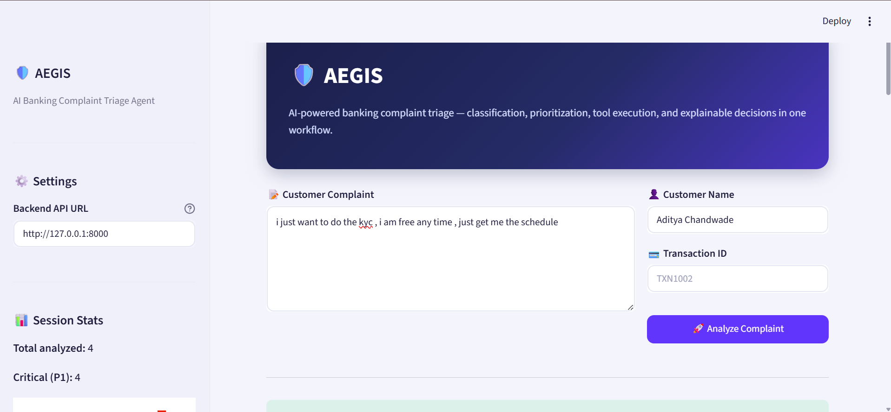
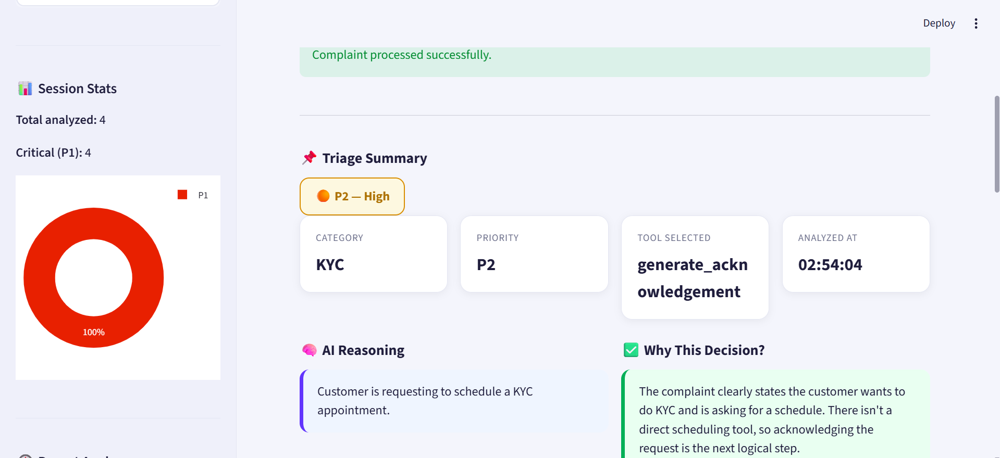
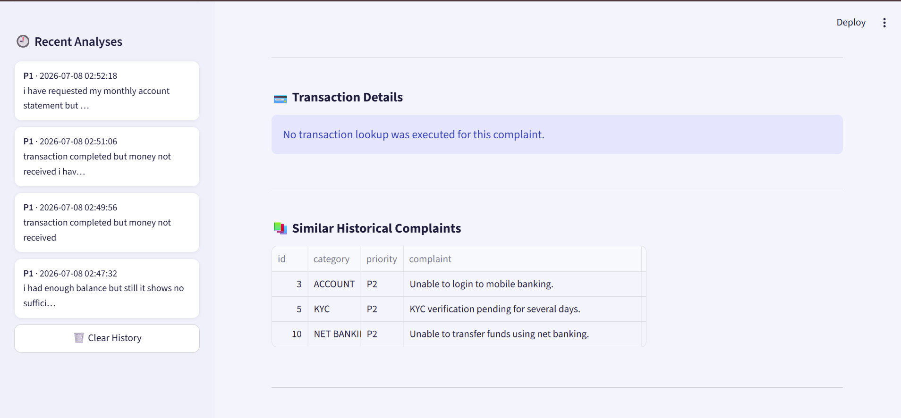
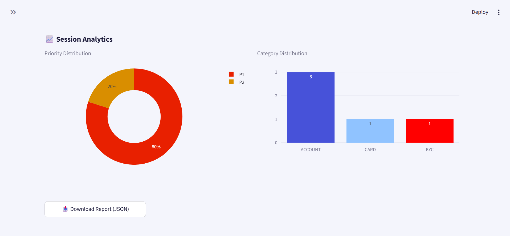

# 🛡️ AEGIS — AI Banking Complaint Triage Agent

**AEGIS** is an AI-powered banking complaint triage system that classifies customer complaints, assigns priorities, and executes real tool calls to return a structured, explainable triage decision — all through an interactive dashboard.

Built with **FastAPI**, **Google Gemini**, **Streamlit**, **Plotly**, and **Scikit-learn**.


---

## Table of Contents

- [Overview](#overview)
- [Features](#features)
- [Architecture](#architecture)
- [Tech Stack](#tech-stack)
- [Available Tools](#available-tools)
- [API Reference](#api-reference)
- [Project Structure](#project-structure)
- [Getting Started](#getting-started)
- [Dashboard Walkthrough](#dashboard-walkthrough)
- [Example Workflow](#example-workflow)
- [Testing](#testing)
- [Roadmap](#roadmap)
- [Contributing](#contributing)
- [License](#license)
- [Author](#author)

---

## Overview

Customer complaints in banking are typically categorized and routed manually before reaching the right support team. AEGIS automates this end-to-end by:

1. Understanding a free-text complaint
2. Assigning a category and priority (P1 / P2 / P3)
3. Selecting the appropriate next action
4. Executing the relevant tool (transaction lookup, similarity search, acknowledgement generation)
5. Generating a customer-facing acknowledgement

Every decision is returned with transparent reasoning, so the triage output can be audited rather than treated as a black box.

---

## Features

- 🤖 AI-powered complaint classification using Gemini
- 🚦 Color-coded priority assignment (P1 Critical / P2 High / P3 Normal)
- 🔧 Real tool calling (not simulated)
- ⚡ FastAPI REST API with Swagger documentation
- 📊 Interactive Streamlit dashboard with a configurable backend URL
- 🔍 Similar complaint search using TF-IDF
- 💳 Transaction lookup tool
- ✉️ Automated customer acknowledgement generation
- 🧠 Explainable AI output (`reasoning` + `why`)
- 📈 Live session analytics — priority and category distribution charts
- 🕘 In-session complaint history with quick recall
- 📥 One-click JSON report export
- 📁 Example dataset included

---

## Architecture

```
                Customer Complaint
                       │
                       ▼
               Gemini Decision Engine
                       │
        ┌──────────────┼──────────────┐
        ▼              ▼              ▼
Transaction Lookup  Similar Search  Acknowledgement
        │              │              │
        └──────────────┼──────────────┘
                       ▼
                Final Structured Output
                       │
                       ▼
              Streamlit Dashboard
```

---

## Tech Stack

| Component          | Technology     |
|---------------------|----------------|
| Backend             | FastAPI        |
| AI Model            | Google Gemini  |
| Frontend            | Streamlit      |
| Charts / Analytics  | Plotly         |
| ML                  | Scikit-learn   |
| Similarity Search   | TF-IDF         |
| API Documentation   | Swagger        |
| Language            | Python         |

---

## Available Tools

### 1. Transaction Lookup
Looks up transaction details by transaction ID.

**Returns:** transaction status, payment mode, amount, customer ID

### 2. Similar Complaint Search
Uses TF-IDF vector similarity to retrieve related historical complaints, along with their category and priority.

### 3. Acknowledgement Generator
Generates a customer-facing acknowledgement once a complaint is registered.

---

## API Reference

### Health Check

```http
GET /health
```

### Complaint Triage

```http
POST /triage
```

**Request body**

```json
{
  "customer_name": "Aditya Chandwade",
  "complaint": "i just want to do the kyc, i am free any time, just get me the schedule",
  "transaction_id": "TXN1002"
}
```

**Response**

```json
{
  "decision": {
    "category": "KYC",
    "priority": "P2",
    "next_tool": "generate_acknowledgement",
    "reasoning": "Customer is requesting to schedule a KYC appointment.",
    "why": "The complaint clearly states the customer wants to do KYC and is asking for a schedule. There isn't a direct scheduling tool, so acknowledging the request is the next logical step."
  },
  "tool_output": null,
  "similar_cases": [
    { "id": 3, "category": "ACCOUNT", "priority": "P2", "complaint": "Unable to login to mobile banking." },
    { "id": 5, "category": "KYC", "priority": "P2", "complaint": "KYC verification pending for several days." },
    { "id": 10, "category": "NET BANKING", "priority": "P2", "complaint": "Unable to transfer funds using net banking." }
  ],
  "acknowledgement": "Dear Aditya Chandwade,\n\nWe have successfully received your complaint.\n\nOur support team has started reviewing the issue.\n\nYou will receive an update shortly.\n\nRegards,\nAEGIS Support"
}
```

Full interactive documentation is available via Swagger once the API is running (see [Getting Started](#getting-started)).

---

## Project Structure

```
AEGIS/
├── .streamlit/
│   └── config.toml          # Forces a consistent light theme
├── app/
│   ├── agent/
│   ├── api/
│   ├── models/
│   ├── tools/
│   └── main.py
├── database/
├── examples/
├── screenshots/
├── tests/
├── streamlit_app.py
├── requirements.txt
└── README.md
```

---

## Getting Started

### 1. Clone the repository

```bash
git clone <repository_url>
cd AEGIS
```

### 2. Create a virtual environment

**Windows**

```cmd
python -m venv venv
venv\Scripts\activate
```

**macOS / Linux**

```bash
python3 -m venv venv
source venv/bin/activate
```

### 3. Install dependencies

```bash
pip install -r requirements.txt
```

### 4. Configure environment variables

Create a `.env` file in the project root:

```
GEMINI_API_KEY=YOUR_API_KEY
```

### 5. Set the dashboard theme (recommended)

Create `.streamlit/config.toml` so the dashboard renders consistently regardless of the viewer's system theme:

```toml
[theme]
base = "light"
primaryColor = "#2563eb"
backgroundColor = "#f4f6fb"
secondaryBackgroundColor = "#ffffff"
textColor = "#1a2138"
font = "sans serif"
```

### 6. Run the FastAPI backend

```bash
uvicorn app.main:app --reload
```

API docs will be available at:

```
http://127.0.0.1:8000/docs
```

### 7. Run the Streamlit dashboard

In a **second terminal** (with the same virtual environment activated):

```bash
streamlit run streamlit_app.py
```

The dashboard opens at `http://localhost:8501`. Both the backend and the frontend need to stay running in their own terminals for the app to work end to end.

---

## Dashboard Walkthrough

### Home & Complaint Input
The landing view lets a support agent enter the customer's complaint, name, and an optional transaction ID, with the backend API URL configurable from the sidebar.




### Triage Summary
Once analyzed, AEGIS returns a color-coded priority badge along with category, priority, and selected tool — plus a plain-language explanation of the decision.



### Transaction Details & Similar Complaints
If a transaction lookup isn't triggered, the dashboard says so explicitly rather than showing an empty section. Similar historical complaints are pulled via TF-IDF similarity and shown in a sortable table.



### Customer Acknowledgement
A ready-to-send acknowledgement message is generated automatically for the customer.


### Session Analytics
As more complaints are analyzed in a session, AEGIS tracks priority and category distribution live, with a downloadable JSON report of the full session.



---

## Example Workflow

```
Customer Complaint
        ↓
  Gemini Classifier
        ↓
 Priority Assignment
        ↓
   Tool Selection
        ↓
   Tool Execution
        ↓
 Structured Response
        ↓
Customer Acknowledgement
```

**Sample output:**

| Field    | Value                     |
|----------|---------------------------|
| Category | KYC                       |
| Priority | P2 — High                 |
| Tool     | generate_acknowledgement  |

---

## Testing

Before deploying or submitting the project, verify the following:

- [ ] `python test_tools.py` runs without errors
- [ ] `python test_agent.py` returns a structured decision
- [ ] `python test_orchestrator.py` executes the selected tool and returns the full response
- [ ] `uvicorn app.main:app --reload` starts the API and Swagger loads at `/docs`
- [ ] `streamlit run streamlit_app.py` opens the UI and successfully calls the backend
- [ ] The `examples/` folder contains sample JSON requests
- [ ] `.env` and `venv/` are excluded from version control (see `.gitignore`)

---

## Roadmap

- [ ] RAG-based knowledge base
- [ ] LangGraph-based orchestration
- [ ] Redis caching layer
- [ ] PostgreSQL persistence for complaint history
- [ ] Authentication & authorization
- [ ] Docker deployment
- [ ] Kubernetes deployment
- [ ] Monitoring dashboard

---

## Contributing

Contributions are welcome. Please open an issue to discuss proposed changes before submitting a pull request.

---


## Author

**Aditya Chandwade**
